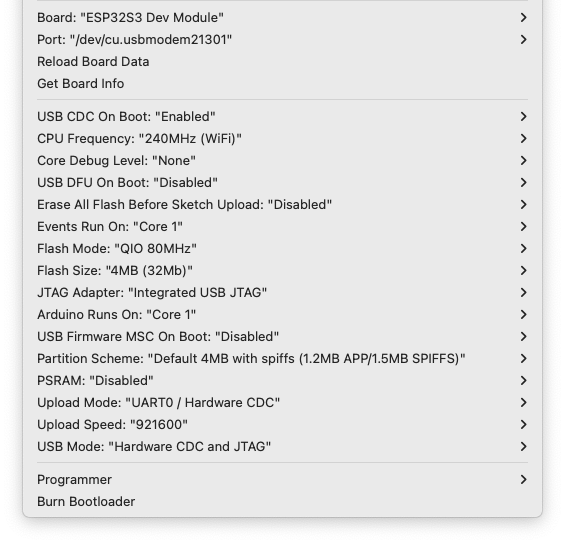

### Air Quality Sensor - code

To compile make sure you are on this version of the ESP32: 
esp32s3 version 2.0.17
 
 
Libraries to install: 
 
PMS Library@1.1.0 
FastLED@3.6.0 
ESPAsyncWebSrv@1.2.7 
ArduinoJson@6.21.4 
Tween.h@0.4.2 by hideakitai 
NTPClient@3.2.1 

 
 
NTP library link: 

https://github.com/arduino-libraries/NTPClient 

 
Install Erriez Arduino Libraries: 

https://github.com/Erriez/ErriezArduinoLibraries 

Arduino IDE settings: 

